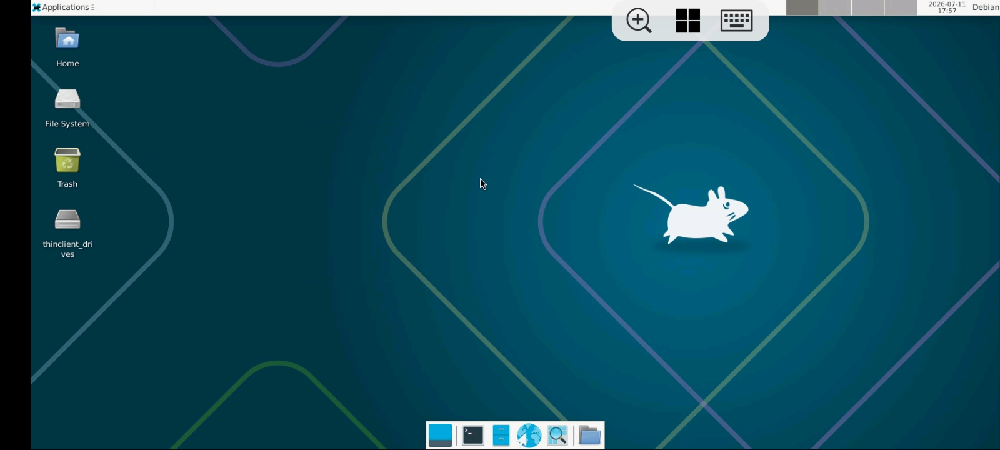
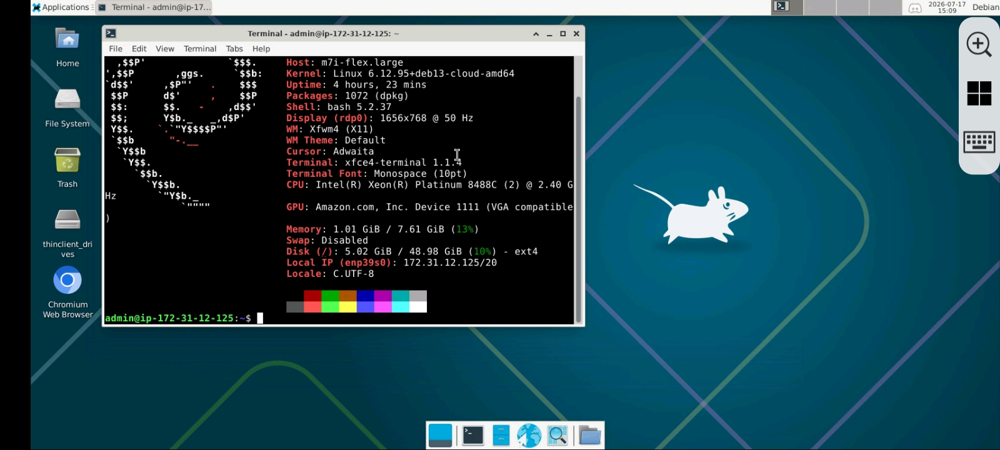

<div align="center">

# 🖥️ Linux Remote Desktop

### ⚡ Transform Your Ubuntu/Debian Server into a Beautiful Remote Desktop

<p>


</p>

<p>


</p>

<h3>🚀 Lightweight • Fast • Secure • Beginner Friendly • Open Source</h3>

---

**Turn any Ubuntu or Debian server into a fully functional Remote Desktop using XFCE and XRDP in just a few minutes.**

⭐ **If this project helps you, don't forget to Star the repository!**

</div>

---

# 📑 Table of Contents

- 📖 Overview
- ✨ Features
- 📂 Repository Structure
- 🚀 Quick Installation
- 📜 Manual Installation
- 🖥️ Connect via RDP
- 📸 Screenshots
- ⚙️ Useful Commands
- 🗑️ Uninstallation
- 📋 Requirements
- 💡 Why XFCE?
- 🛣️ Roadmap
- 🤝 Contributing
- 🐞 Report Issues
- 📄 License

---

# 📖 Overview

**Linux Remote Desktop** provides a quick and reliable way to install **XFCE Desktop Environment** with **XRDP** on Ubuntu and Debian.

Perfect for:

- ☁️ AWS EC2
- 🌐 Google Cloud
- 💙 Azure
- ☁️ Oracle Cloud
- 🚀 DigitalOcean
- 🖥️ VPS Servers
- 🏠 Home Servers
- 💻 Development Machines

---

# ✨ Features

- ✅ Lightweight XFCE Desktop
- ✅ XRDP Remote Desktop
- ✅ Automatic Service Configuration
- ✅ Firewall Configuration
- ✅ Easy Installation Script
- ✅ Easy Uninstall Script
- ✅ Beginner Friendly
- ✅ Ubuntu Support
- ✅ Debian Support
- ✅ Open Source
- ✅ Fast Installation
- ✅ Clean Desktop Experience

---

# 📂 Repository Structure

```text
linux-remote-desktop/
│
├── README.md
├── LICENSE
├── install.sh
├── uninstall.sh
├── CHANGELOG.md
├── CONTRIBUTING.md
├── SECURITY.md
├── .gitignore
└── screenshots/
    ├── login.png
    ├── desktop.png
```

---

# 🚀 Quick Installation

Clone the repository

```bash
git clone https://github.com/nihent/linux-remote-desktop.git
```

Enter the project

```bash
cd linux-remote-desktop
```

Give execute permission

```bash
chmod +x install.sh
```

Run installer

```bash
./install.sh
```

That's it! 🎉

---

# 📜 Manual Installation

```bash
sudo apt update && sudo apt upgrade -y

sudo apt install -y xfce4 xfce4-goodies xrdp dbus-x11

echo "xfce4-session" > ~/.xsession

sudo systemctl enable --now xrdp

sudo ufw allow 3389/tcp

sudo reboot
```

---

# 🖥️ Connect Using Remote Desktop

## Windows

Press

```
Win + R
```

Type

```
mstsc
```

Enter

```
YOUR_SERVER_IP
```

Login using

- Linux Username
- Linux Password

You're connected! 🎉

---

# 📸 Screenshots

## Login Screen


---

## Desktop



---

## File Manager


---

## Terminal



---

# ⚙️ Useful Commands

## XRDP Status

```bash
systemctl status xrdp
```

## Restart XRDP

```bash
sudo systemctl restart xrdp
```

## Stop XRDP

```bash
sudo systemctl stop xrdp
```

## Start XRDP

```bash
sudo systemctl start xrdp
```

## Enable XRDP

```bash
sudo systemctl enable xrdp
```

## Disable XRDP

```bash
sudo systemctl disable xrdp
```

---

# 🗑️ Uninstallation

```bash
chmod +x uninstall.sh

./uninstall.sh
```

---

# 📋 Requirements

| Requirement | Supported |
|--------------|-----------|
| Ubuntu | ✅ |
| Debian | ✅ |
| Internet | ✅ |
| Sudo Access | ✅ |
| VPS | ✅ |
| Dedicated Server | ✅ |

---

# 💡 Why XFCE?

| Feature | Benefit |
|---------|----------|
| ⚡ Lightweight | Low RAM Usage |
| 🚀 Fast | Smooth Performance |
| 🎨 Beautiful | Clean Interface |
| 🔒 Stable | Reliable Desktop |
| 💻 Beginner Friendly | Easy to Use |

---

# 📊 Project Status

| Status | Value |
|---------|-------|
| Active Development | ✅ |
| Open Source | ✅ |
| Community Friendly | ✅ |
| Beginner Friendly | ✅ |

---

# 🛣️ Roadmap

- [x] XFCE Installation
- [x] XRDP Setup
- [x] Firewall Configuration
- [x] Installation Script
- [x] Uninstallation Script
- [x] Documentation
- [ ] Audio Support
- [ ] Dark Theme Installer
- [ ] Google Chrome Installer
- [ ] VS Code Installer
- [ ] Docker Installer
- [ ] NVIDIA Driver Support
- [ ] Automatic Updates

---

# 🤝 Contributing

Contributions are welcome!

1. Fork the repository.
2. Create your branch.
3. Commit your changes.
4. Push your branch.
5. Open a Pull Request.

---

# 🐞 Found a Bug?

Open a GitHub Issue with:

- Operating System
- Server Provider
- Error Logs
- Steps to Reproduce

---

# ❤️ Support the Project

If this repository helped you:

⭐ Star this repository

🍴 Fork this repository

📢 Share it with others

💬 Suggest new features

🐛 Report bugs

Every contribution helps make this project better.

---

# 📜 License

This project is licensed under the **MIT License**.

---

<div align="center">

## 🌍 Built for the Linux Community

Made with ❤️ by **Nihent**

### ⭐ Thanks for Visiting ⭐

If you like this project, please consider giving it a Star!

</div>
