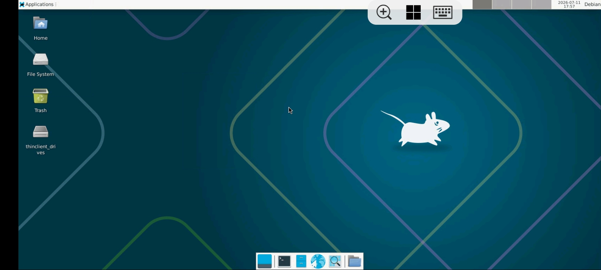
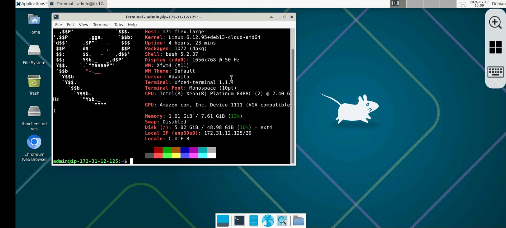

<div align="center">

# 🖥️ Linux Remote Desktop

### ⚡ Transform Your Ubuntu/Debian Server into a Beautiful Remote Desktop

<p>


</p>

<p>


</p>

<h3>🚀 Lightweight • Fast • Secure • Beginner Friendly • Open Source</h3>

---

**Turn any Ubuntu or Debian server into a fully functional Remote Desktop using XFCE and XRDP in just a few minutes.**

⭐ **If this project helps you, don't forget to Star the repository!**

</div>

---

# 📑 Table of Contents

- 📖 Overview
- ✨ Features
- 📂 Repository Structure
- 🚀 Quick Installation
- 📜 Manual Installation
- 🖥️ Connect via RDP
- 📸 Screenshots
- ⚙️ Useful Commands
- 🗑️ Uninstallation
- 📋 Requirements
- 💡 Why XFCE?
- 🛣️ Roadmap
- 🤝 Contributing
- 🐞 Report Issues
- 📄 License

---

# 📖 Overview

**Linux Remote Desktop** provides a quick and reliable way to install **XFCE Desktop Environment** with **XRDP** on Ubuntu and Debian.

Perfect for:

- ☁️ AWS EC2
- 🌐 Google Cloud
- 💙 Azure
- ☁️ Oracle Cloud
- 🚀 DigitalOcean
- 🖥️ VPS Servers
- 🏠 Home Servers
- 💻 Development Machines

---


## 👤 About This Setup

This project is a **community setup/documentation guide**.

> **Important:** I did not create or develop all of the underlying software used in this setup. This repository mainly documents a practical way to configure an Ubuntu/Debian server with XFCE, XRDP, and remote audio/microphone support.

The actual software components are developed and maintained by their respective open-source projects.

This repository is intended to make the setup easier for beginners by bringing the required commands, configuration, and usage instructions together in one place.


# ✨ Features

- ✅ Lightweight XFCE Desktop
- ✅ XRDP Remote Desktop
- ✅ Automatic Service Configuration
- ✅ Firewall Configuration
- ✅ Easy Installation Script
- ✅ Easy Uninstall Script
- ✅ Beginner Friendly
- ✅ Ubuntu Support
- ✅ Debian Support
- ✅ Open Source
- ✅ Fast Installation
- ✅ Clean Desktop Experience
- 🔊 Remote Audio Output Support
- 🎙️ Remote Microphone Input Support
- 🎧 PipeWire + WirePlumber Audio Stack
- 🎛️ Remote Audio Controls with Pavucontrol

---

# 🚀 Quick Installation

Clone the repository

```bash
git clone https://github.com/nihent/linux-remote-desktop.git
```

Enter the project

```bash
cd linux-remote-desktop
```

Give execute permission

```bash
chmod +x install.sh
```

Run installer

```bash
./install.sh
```

That's it! 🎉 XFCE + XRDP with remote audio and microphone support is now installed.

---

# 📜 Manual Installation

## 1️⃣ Update the System

```bash
sudo apt update && sudo apt upgrade -y
```

## 2️⃣ Install XFCE + XRDP

```bash
sudo apt install -y \
  xfce4 \
  xfce4-goodies \
  xrdp \
  xorgxrdp \
  dbus-x11
```

## 3️⃣ Configure XFCE Session

```bash
printf '%s\n' 'exec startxfce4' > ~/.xsession
chmod +x ~/.xsession
```

## 4️⃣ Install Audio + Microphone Support

```bash
sudo apt install -y \
  pipewire \
  pipewire-pulse \
  wireplumber \
  pipewire-module-xrdp \
  libpipewire-0.3-modules-xrdp \
  pavucontrol \
  xfce4-pulseaudio-plugin
```

This adds:

- 🔊 Remote audio playback
- 🎙️ Remote microphone input
- 🎧 PipeWire audio support
- 🎛️ Audio controls through Pavucontrol
- 🔌 XRDP audio integration

## 5️⃣ Enable XRDP

```bash
sudo systemctl enable --now xrdp
```

## 6️⃣ Configure Firewall

If UFW is enabled:

```bash
sudo ufw allow 3389/tcp
```

## 7️⃣ Reboot

```bash
sudo reboot
```

> **RDP Client Note:** Audio and microphone redirection also depends on your RDP client. On Windows Remote Desktop (`mstsc`), enable remote audio playback and microphone/recording redirection before connecting.

---

# 🖥️ Connect Using Remote Desktop

## Windows

Press

```
Win + R
```

Type

```
mstsc
```

Enter

```
YOUR_SERVER_IP
```

Login using

- Linux Username
- Linux Password

You're connected! 🎉

---

# 📸 Screenshots

## Login Screen


---

## Desktop



---

## File Manager


---

## Terminal



---

# ⚙️ Useful Commands

## XRDP Status

```bash
systemctl status xrdp
```

## Restart XRDP

```bash
sudo systemctl restart xrdp
```

## Stop XRDP

```bash
sudo systemctl stop xrdp
```

## Start XRDP

```bash
sudo systemctl start xrdp
```

## Enable XRDP

```bash
sudo systemctl enable xrdp
```

## Disable XRDP

```bash
sudo systemctl disable xrdp
```

---


# 🛠️ Basic Troubleshooting

## XRDP Status

```bash
systemctl status xrdp
```

## Restart XRDP

```bash
sudo systemctl restart xrdp
```

## Check Audio Services

```bash
systemctl --user status pipewire
systemctl --user status wireplumber
```

## Open Audio Controls

```bash
pavucontrol
```

If audio or microphone redirection is not working, verify the RDP client's audio playback and microphone/recording redirection settings.

---

# 🗑️ Uninstallation

Run:

```bash
chmod +x uninstall.sh
./uninstall.sh
```

The uninstaller removes the main components installed by this project:

- XFCE Desktop
- XRDP
- Xorg XRDP
- PipeWire
- PipeWire Pulse
- WirePlumber
- XRDP audio modules
- Pavucontrol
- XFCE audio plugin
- RDP firewall rule
- Project-created XFCE session configuration

## ⚠️ Important: Uninstallation Is Not a Full Rollback

`uninstall.sh` cleans the main packages and configuration installed by this project, but **it does NOT guarantee that the server will return to exactly the same state it was in before installation.**

In simple words:

> ❌ Uninstalling does **not** mean the system becomes exactly "as if this project was never installed."

> ✅ It removes the main components and cleans unused packages where possible.

Some package dependencies, system-level changes, cached data, or other configuration changes may remain.

The uninstaller **does not delete your personal files, home directory, SSH keys, user account, or unrelated applications.**

If you require a completely fresh server, the safest option is to rebuild/reinstall the server from your cloud provider's original image.

---


# ⚠️ Limitations & Notes

### 🎙️ Microphone Support

Remote microphone support depends on the RDP client and server-side audio stack being compatible and correctly configured. If the microphone does not appear, check the RDP client's audio/recording redirection settings first.

### 🔊 Audio Support

Remote audio is also dependent on the RDP client. The packages in this project provide the server-side PipeWire/XRDP integration, but they cannot guarantee identical behavior across every RDP client, Linux distribution, or server image.

### 🌐 VPS / Cloud Servers

Performance depends on the server's CPU, RAM, network connection, and provider. A lightweight XFCE desktop is recommended for small VPS instances.

### 🔐 Security

Port `3389` should not be exposed unnecessarily to the entire internet. Where possible, restrict RDP access using your cloud provider's firewall/security group, a VPN, or an allowed IP range.

### 🧪 Compatibility

Package names and availability can vary between Ubuntu/Debian releases. If a package is unavailable on a particular release, the installation may need to be adjusted for that distribution/version.

---

# 📋 Requirements

| Requirement | Supported |
|--------------|-----------|
| Ubuntu | ✅ |
| Debian | ✅ |
| Internet | ✅ |
| Sudo Access | ✅ |
| VPS | ✅ |
| Dedicated Server | ✅ |
| RDP Client | Required |
| Audio/Mic Redirection | Client Dependent |

---

# 💡 Why XFCE?

| Feature | Benefit |
|---------|----------|
| ⚡ Lightweight | Low RAM Usage |
| 🚀 Fast | Smooth Performance |
| 🎨 Beautiful | Clean Interface |
| 🔒 Stable | Reliable Desktop |
| 💻 Beginner Friendly | Easy to Use |

---

# 📊 Project Status

| Status | Value |
|---------|-------|
| Active Development | ✅ |
| Open Source | ✅ |
| Community Friendly | ✅ |
| Beginner Friendly | ✅ |

---

# 🛣️ Roadmap

- [x] XFCE Installation
- [x] XRDP Setup
- [x] Firewall Configuration
- [x] Installation Script
- [x] Uninstallation Script
- [x] Documentation
- [x] Audio Output Support
- [x] Microphone Input Support
- [x] PipeWire + XRDP Audio Integration
- [ ] Dark Theme Installer
- [ ] Google Chrome Installer
- [ ] VS Code Installer
- [ ] Docker Installer
- [ ] NVIDIA Driver Support
- [ ] Automatic Updates

---

# 🤝 Contributing

Contributions are welcome!

1. Fork the repository.
2. Create your branch.
3. Commit your changes.
4. Push your branch.
5. Open a Pull Request.

---

# 🐞 Found a Bug?

Open a GitHub Issue with:

- Operating System
- Server Provider
- Error Logs
- Steps to Reproduce

---

# ❤️ Support the Project

If this setup helped you, consider supporting the project by:

⭐ Star this repository

🍴 Fork this repository

📢 Share it with others

💬 Suggest new features

🐛 Report bugs

Every contribution helps make this project better.

---

<div align="center">

## 🌍 Built for the Linux Community


### ⭐ Thanks for Visiting ⭐

If you like this project, please consider giving it a Star!

</div>
